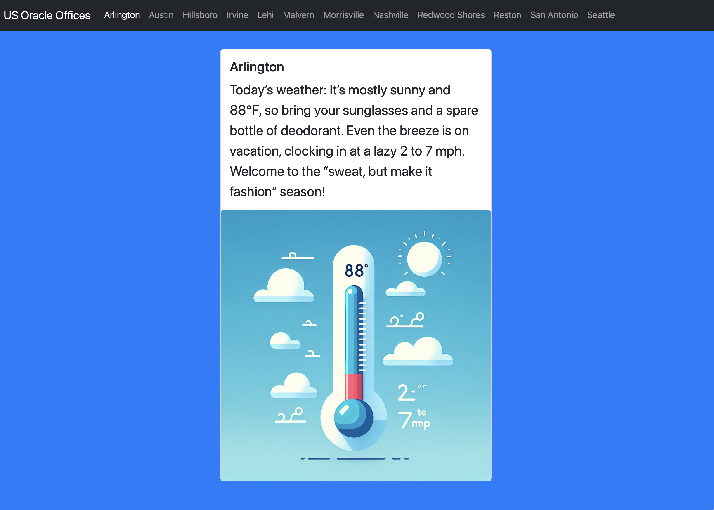

# Run

Define `LANGCHAIN4J_OPEN_AI_API_KEY` environment variable with an OpenAI API key. Then, you can run the application, use the following command:

```bash
./gradlew run
```

Once you run it, the application attempts to load a forecast and generate text and image based on the weather data.
Once it finishes, it will show something like this: 



Inspired by [Carrot Weather](https://www.meetcarrot.com/weather/).