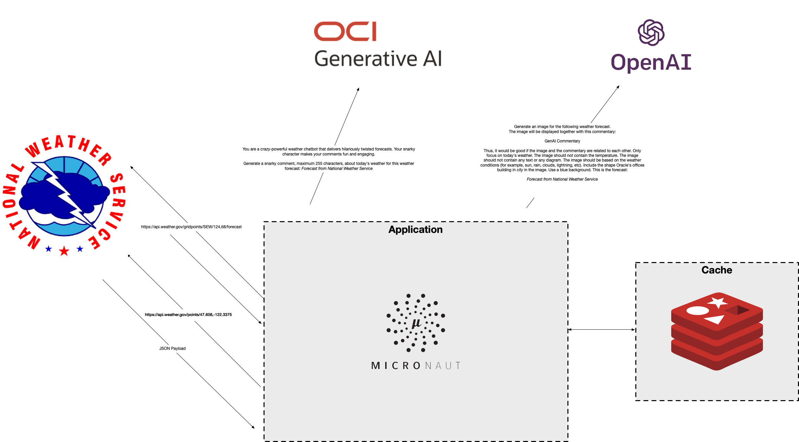
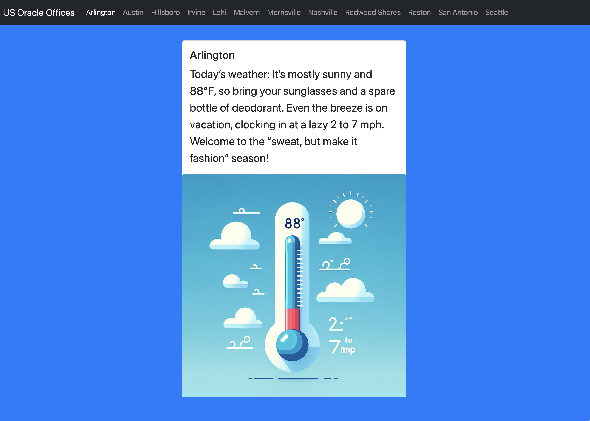

This repository contains a [Micronaut](https://micronaut.io) application that displays the weather forecast for each of the Oracle offices in the US.

For each location, it fetches the:
- Fetches the weather forecast from https://api.weather.gov
- It asks the GenAI chat model to give you the city name based on the latitude and longitude of the office.
- It asks GenAI to provide you with a snarky comment about the weather forecast.
- It asks GenAI to generate an image based on the weather forecast.



Prompts are in txt files in `src/main/resources/prompts`. 

As these requests take time, the application loads them asynchronously with HTMX[(https://htmx.org). 

The weather forecast, images and comments are cache for 30 minutes with [Micronaut Cache](https://micronaut-projects.github.io/micronaut-cache/latest/guide/) and Caffeine.

It uses [Micronaut Langchain4j](https://micronaut-projects.github.io/micronaut-langchain4j/latest/guide/) to interact with the GenAI models.

For server-based template rendering engine it uses [Micronaut Views with Thymeleaf](https://micronaut-projects.github.io/micronaut-views/latest/guide/#thymeleaf).

To consume the https://api.weather.gov it uses a declarative [Micronaut HTTP client](https://docs.micronaut.io/latest/guide/#httpClient). 

The application is [GraalVM Native Image](https://www.graalvm.org/latest/reference-manual/native-image/) compatible. You can package it as a native image and run it.

# Run

Run redis locally for cache: 

```
docker run --name my-redis -p 6379:6379 -d redis:latest
```

Define `LANGCHAIN4J_OPEN_AI_API_KEY` environment variable with an OpenAI API key. Then, you can run the application, use the following command:

```bash
./gradlew run
```

Once you run it, the application attempts to load a forecast and generate text and image based on the weather data.
Once it finishes, it will show something like this: 




# Package as GraalVM Native Image

To package the application as a GraalVM Native Image, run: 

```bash
./gradlew nativeCompile
```

You can the execute the native image with:

```bash
build/native/nativeCompile/weathergenai
```

Inspired by [Carrot Weather](https://www.meetcarrot.com/weather/).